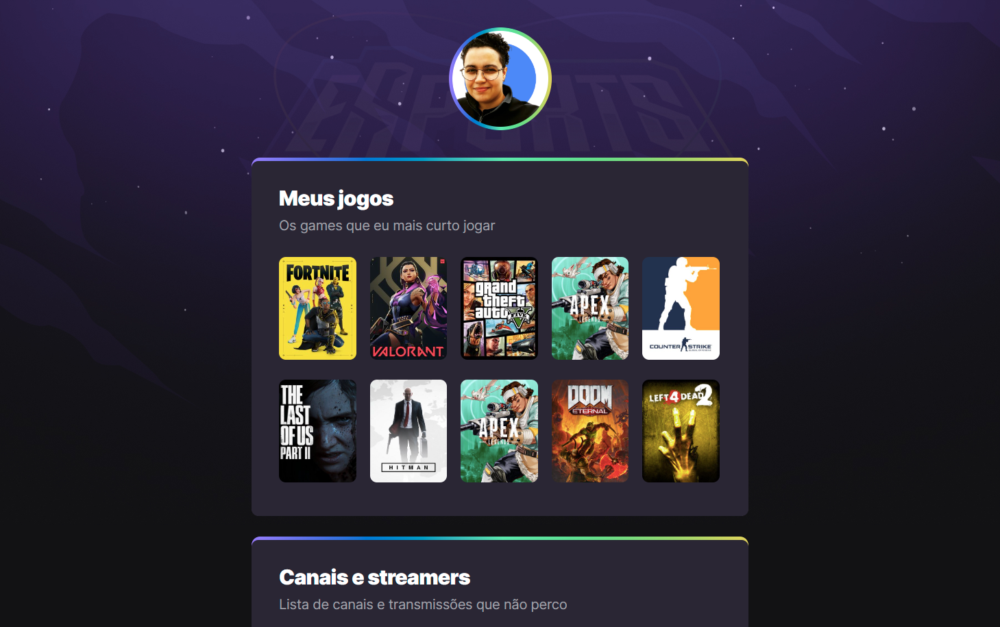

# NLW eSports

> Trilha Explorer

Projeto construído do evento Next Level Week da Rocketseat.

[Clique aqui para acessar](https://aneris91.github.io/nlw-esports-explorer/)

## 🛠️ Tecnologias
- HTML
- CSS
- Git e Github

## 📚 O que aprendi

- Criar seções diferentes;
- Criar uma borda degradê, dando o aspecto de profundidade ao cartão;
- Inserir o ".", no código ainda, para que o background apareça;
- Inserir os links dos jogos, e as respectivas imagens, utilizando o botão direito do mouse;
- Como centralizar a imagem com minha foto;
- Como criar o aspecto de degradê ao fundo da página;
- A comunidade da Rocketseat é realmente incrível!
- O professor Mayk Brito entende nossas dúvidas, mesmo a aula não sendo ao vivo, e como se fosse mágina, nos explica exatamente o que precisávamos.

## 📧 Contato

anerisdeveloper@gmail.com